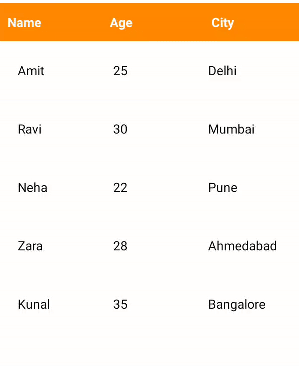

## SortableTableView (Android – Kotlin)
[](https://kotlinlang.org/)
[](LICENSE)
[](#)
---

A lightweight, RecyclerView-based sortable table view for Android, written in Kotlin, with full XML customization support.

This library allows you to display tabular data with clickable column headers, ascending/descending sorting, and high performance even with large datasets.

---

### Features

- RecyclerView-based (smooth scrolling, large data support)
- Click column header to sort (ASC / DESC)
- Automatic arrow indicators (↑ ↓)
- Supports String & Number sorting
- Fully customizable via XML attributes
- Clean & simple public API
- Zero Activities, zero Fragments (pure View library)
- Easy to integrate in any Android project

---

### Preview

 

---

## Installation (JitPack)

### 1️⃣ Add JitPack to your **root `settings.gradle` or `build.gradle`**

```gradle
dependencyResolutionManagement {
    repositories {
        google()
        mavenCentral()
        maven { url 'https://jitpack.io' }
    }
}
```

### Add Dependency
```
	dependencies {
	        implementation 'com.github.Excelsior-Technologies-Community:Android_SortableTableView:1.0.0'
	}
```

---

### Usage

Add View in XML
```xml
<com.ext.sortabletableview.SortableTableView
    android:id="@+id/sortableTable"
    android:layout_width="match_parent"
    android:layout_height="wrap_content"
    app:stv_headerTextColor="@android:color/white"
    app:stv_rowTextColor="@android:color/black"
    app:stv_textSize="14sp"
    app:stv_headerBackground="@color/purple_500"
    app:stv_cellPadding="12dp" />
```

Set Headers & Data in Kotlin
```kotlin
val table = findViewById<SortableTableView>(R.id.sortableTable)

table.setHeaders(
    listOf("Name", "Age", "City")
)

table.setData(
    listOf(
        TableRowData(listOf("Amit", 25, "Delhi")),
        TableRowData(listOf("Ravi", 30, "Mumbai")),
        TableRowData(listOf("Neha", 22, "Pune"))
    )
)
```

### Sorting Behavior

- Tap a column header → Ascending sort
- Tap same header again → Descending sort
- Arrow indicators update automatically:
   - ↑ Ascending
   - ↓ Descending
- Only one active column shows sort indicator at a time

### RecyclerView Support (Performance Optimized)

`SortableTableView` is built **on top of RecyclerView**, which makes it suitable for **large datasets** and ensures **smooth scrolling** and **better performance** compared to traditional LinearLayout-based tables.

You **do not need to manage RecyclerView manually** — the library handles it internally.

### Why RecyclerView?

- Smooth scrolling with large datasets
- Efficient view recycling
- Better memory usage
- Production-ready architecture

---

Usage in kotlin
```kotlin
val table = findViewById<SortableTableView>(R.id.sortableTable)

table.setHeaders(listOf("Name", "Age", "City"))

val rows = mutableListOf<TableRowData>()
for (i in 1..500) {
    rows.add(
        TableRowData(
            listOf(
                "User $i",
                (18..60).random(),
                "City ${(1..20).random()}"
            )
        )
    )
}

table.setData(rows)
```


---

### 🎨 XML Attributes

| Attribute | Description |
|---------|------------|
| `stv_headerTextColor` | Header text color |
| `stv_rowTextColor` | Row text color |
| `stv_textSize` | Text size (sp) |
| `stv_headerBackground` | Header background |
| `stv_rowBackground` | Row background |
| `stv_cellPadding` | Padding inside each cell |

---

### License

```
MIT License

Copyright (c) 2025 Excelsior Technologies 

Permission is hereby granted, free of charge, to any person obtaining a copy
of this software and associated documentation files (the "Software"), to deal
in the Software without restriction, including without limitation the rights
to use, copy, modify, merge, publish, distribute, sublicense, and/or sell
copies of the Software, and to permit persons to whom the Software is
furnished to do so, subject to the following conditions:

The above copyright notice and this permission notice shall be included in all
copies or substantial portions of the Software.

THE SOFTWARE IS PROVIDED "AS IS", WITHOUT WARRANTY OF ANY KIND, EXPRESS OR
IMPLIED, INCLUDING BUT NOT LIMITED TO THE WARRANTIES OF MERCHANTABILITY,
FITNESS FOR A PARTICULAR PURPOSE AND NONINFRINGEMENT. IN NO EVENT SHALL THE
AUTHORS OR COPYRIGHT HOLDERS BE LIABLE FOR ANY CLAIM, DAMAGES OR OTHER
LIABILITY, WHETHER IN AN ACTION OF CONTRACT, TORT OR OTHERWISE, ARISING FROM,
OUT OF OR IN CONNECTION WITH THE SOFTWARE OR THE USE OR OTHER DEALINGS IN THE
SOFTWARE.
```


